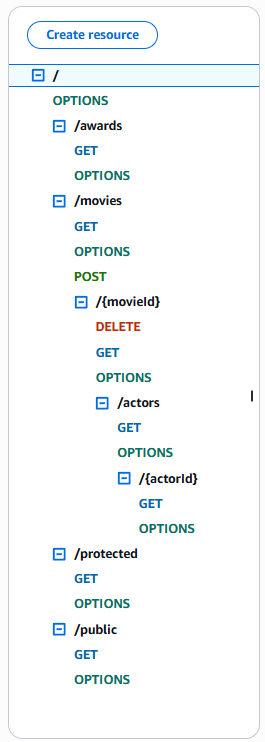
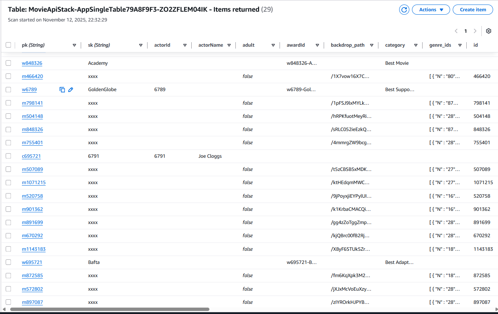

## Assignment - Cloud App Development.

__Name:__ Dominik Falkowski

### Links.
__Demo:__ [Link to YouTube video.](https://youtu.be/q9UbpGeD3hs)

### Screenshots.

### Design features (if required).
Resources: /movies, /movies/{movieId}, /movies/{movieId}/actors, /movies/{movieId}/actors/{actorId}, /awards.
Adds a custom request authorizer (Lambda) reading the Cookie header.
Applies API key protection to admin routes (POST/DELETE).
Seeding with AwsCustomResource

###  Extra (If relevant).

[ State any other aspects of your solution that use CDK/serverless features not covered in the lectures.]

### References.
AI prompts.md
https://serverlessland.com/patterns/dynamodb-seed-data-on-create-cdk
https://www.youtube.com/watch?v=q__Yopq6aio
https://docs.aws.amazon.com/step-functions/latest/dg/cw-logs.html